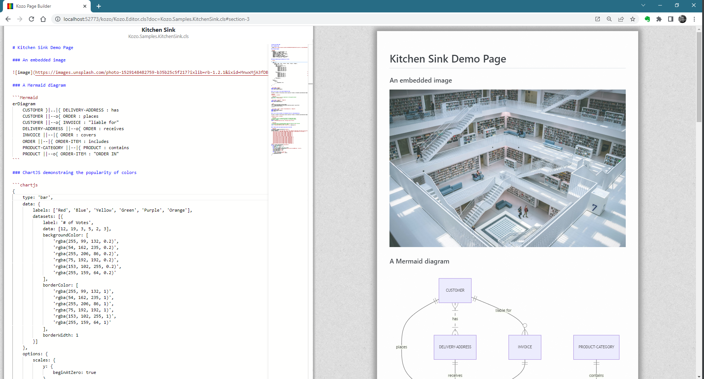
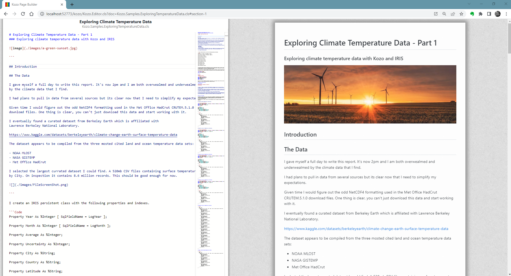
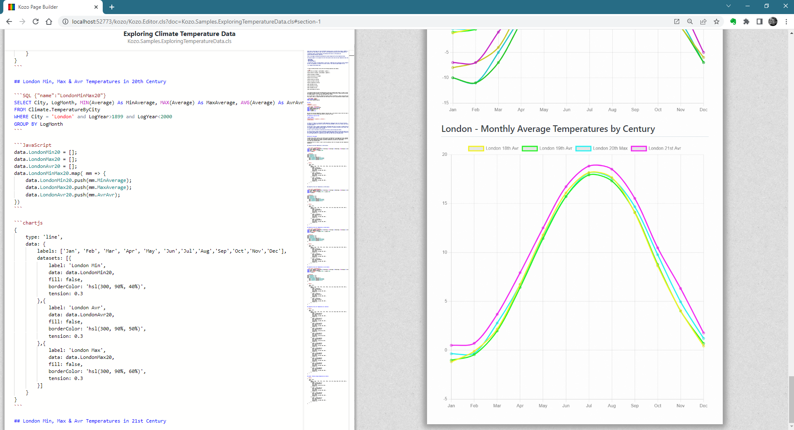

# Kozo

Kozo is a live edit solution for producing

* Technical Documents
* Data Reports
* Web Pages
* Dashboards

Kozo brings together a number of conventional technologies to produce high quality information solutions at speed. These include:-

* Moustache Template Syntax with dynamic injection of data
* Markdown
* Mermaid
* ChartJS
* D3

Kozo also integrates both client side and server side logic directly into the page. This includes:-

* JavaScript
* ObjectScript
* SQL from the client
* REST

Kozo can be used for many purposes and different levels of experience. Its aim is to lower the technical ceiling for
producing data rich web pages and documents for all levels of developers and data scientists.

A primary driver for Kozo is the automatic production of technical documentation that is baked directly into IRIS projects.

### Samples hosted on local Docker instance

If you're running a local docker instance then the following links will open the samples directly

Kitchen Sink: [http://localhost:42773/kozo/Kozo.Editor.cls?ns=USER&doc=Kozo.Samples.KitchenSink.cls](http://localhost:42773/kozo/Kozo.Editor.cls?doc=Kozo.Samples.KitchenSink.cls)

Exploring Temperature Data Part 1: [http://localhost:42773/kozo/Kozo.Editor.cls?ns=USER&doc=Kozo.Samples.ExploringTemperatureData.cls](http://localhost:42773/kozo/Kozo.Editor.cls?doc=Kozo.Samples.ExploringTemperatureData.cls)

Exploring Temperature Data Part 2: [http://localhost:42773/kozo/Kozo.Editor.cls?ns=USER&doc=Kozo.Samples.ExploringTemperatureDataPart2.cls](http://localhost:42773/kozo/Kozo.Editor.cls?doc=Kozo.Samples.ExploringTemperatureDataPart2.cls)

### Samples Exported to PDF
[Kitchen Sink](./sample-documents/Kitchen%20Sink.pdf)

[Letter](./sample-documents/Letter.pdf)

[ExploringTemperatureData Part 1](./sample-documents/Exploring%20Climate%20Temperature%20Data%20-%20Part%201.pdf)

[ExploringTemperatureData Part 2](./sample-documents/Exploring%20Climate%20Temperature%20Data%20-%20Part%202.pdf)

### Running Demo's

The live demo's rely on two sets of data. 

1. The kitchen sink demo has one SQL demo at the end which uses the included class Kozo.Samples.Person, to load data run

do ##class(Kozo.Samples.Person).Populate(10000)

2. The climate data requires 520mb of data which has proved a little hard to include easily. Downloading the data will have to be done manually. To simplify the task the data has been split into small files and pushed to the following GitHub repo:-

https://github.com/SeanConnelly/EarthSurfaceTemperatureDataByCity

Download or pull this repo to the required machine. The run the import method:-

do ##class(Climate.TemperatureByCity).ImportFromGitHub("location of the data folder here")

The import will take a few minutes to complete. Once loaded the Exploring Temperature Data examples will work.

### More Screenshots

### Instructions

Instructions on how to build kozo pages are next on the projects todo list as well as a management page to list, create and access pages.

In the meantime, use studio to create a copy of the Kozo.Template class, naming the new class.

With that new class open, hit F5 (or view web page) and the page will open directly in the editor.

The page will save automatically.

The page preview will automatically update as you type. There is a balance to make the updates work efficiently and fine-tuning this is work in progress. If there are any issues refresh the page.

The entire document is a markdown document, except that code fences are actually executed as code.

These code fences currently support SQL, JavaScript, Mermaid, ChartJS, HTML with more to come. Including being able to inline ObjectScript.

The page has a "data" object which persists across the entire page. This data object can be accessed from any of the code fences as well via Moustache template.

For now the best way to see this in action is to view the Kitchen Sink demo.